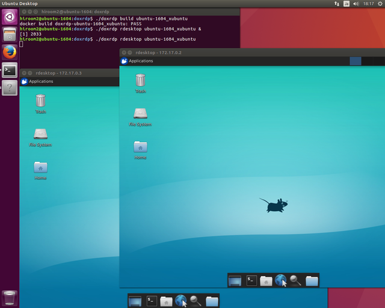

# doxrdp

The doxrdp (Docker for XRDP) provides Docker image which runs XRDP on
Desktop Environment. Because doxrdp script is POSIX shell, if you use
Windows as docker host, you need to use Dockerfile in docker directory
like docker/ubuntu/1604/Dockerfile.

doxrdp uses --squash option [1] of Docker Experimental Features [2].

[1]: https://github.com/docker/docker/pull/22641
[2]: https://github.com/docker/docker/tree/master/experimental

## Usage

    $ doxrdp list            # Show distribution.
    $ doxrdp build           # Build all distribution.
    $ doxrdp build <dist>    # Build distribution.
    $ doxrdp remove          # Remove all distribution.
    $ doxrdp remove <dist>   # Remove distribution.
    $ doxrdp clean           # Clean cache images.
    $ doxrdp rdesktop <dist> # Run rdesktop to distribution.

## Example

    $ doxrdp build ubuntu-1604-xubuntu
    $ doxrdp rdesktop ubuntu-1604-xubuntu &
    $ doxrdp rdesktop ubuntu-1604-xubuntu

## Support distribution

* [Ubuntu 16.04](docker/ubuntu/1604/README.md)
* [Debian 8](docker/debian/8/README.md)
* [CentOS 7](docker/centos/7/README.md)
* [Fedora 24](docker/fedora/24/README.md)
